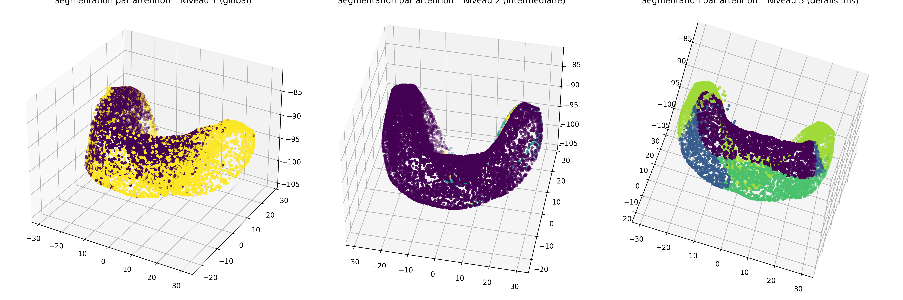

# SetVAE-Dental3D

Modèle SetVAE hiérarchique pour nuages de points dentaires 3D, avec prior en mélange de gaussiennes, inférence bidirectionnelle et visualisations d’attention multi‑niveaux permettant une génération coarse‑to‑fine et l’analyse de la structure latente des dents.

---

## Aperçu du projet



*(Place ton fichier `image.png` dans le dossier racine du repo pour qu’il s’affiche ici.)*

---

## Description

Ce projet implémente une version hiérarchique du **SetVAE (CVPR 2021)** appliquée à des nuages de points dentaires 3D.  
Il inclut :

- un **prior hiérarchique** avec MoG au niveau supérieur,
- une **inférence bidirectionnelle** (top‑down + bottom‑up),
- un **décodeur coarse‑to‑fine** basé sur des blocs ABL,
- un **encodeur ISAB** pour traiter les sets,
- des **visualisations d’attention multi‑niveaux** (global → intermédiaire → fin),
- la génération de dents synthétiques.

Un fichier **tutoriel.pdf** est fourni pour expliquer les équations, la théorie du SetVAE, et comment l’implémentation correspond exactement au modèle mathématique.

---

## Installation

Cloner le dépôt :

```bash
git clone https://github.com/<ton_nom>/<ton_repo>.git
cd <ton_repo>
```
